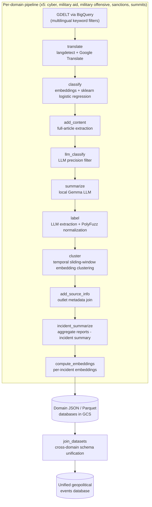

# GeoInsights Data

**An automated pipeline that turns global news into a structured, deduplicated database of geopolitical incidents** — across five domains: **cyberattacks military aid, military offensives, sanctions, and international summits.**

It discovers articles from [GDELT](https://www.gdeltproject.org/) via BigQuery, filters and enriches them with a hybrid machine-learning + LLM stack, clusters related reports into distinct real-world **incidents**, and publishes JSON/Parquet datasets.

This is a research project. The repository is made public to show a method to turn press articles into structured event datasets. This is not intended to be a fully finished software. 

## What it produces

For each domain, the pipeline creates two datasets **reports** (individual enriched articles) and **incidents** (deduplicated real-world events aggregating their reports), plus time-windowed slices (14 days, 1/2/5 years) for fast querying. A cross-domain join merges all five into one unified schema.

An incident looks roughly like this (illustrative):

```json
{
  "incident_id": "20240712-cyber-0-3",
  "incident_type": "Cyberattack",
  "incident_start_date": "2024-07-12",
  "initiating_countries": ["Russia"],
  "receiving_countries": ["Ukraine", "European Union"],
  "sectors": ["Energy", "Government"],
  "threat_actors": ["Sandworm"],
  "summary": "A coordinated cyberattack targeted Ukrainian energy-sector operators ...",
  "num_reports": 14
}
```

## Architecture

Five domains run as parallel tasks of a single Cloud Run Job (`CLOUD_RUN_TASK_INDEX` 0–4). Each domain flows through the same 12-stage, **incremental** pipeline; a separate job joins the outputs.




### Key technical features

- **Hybrid ML + LLM funnel**: a cheap embedding + specialized logistic-regression classifier does filtering first (see example notebook for cyber events in the cyber folder), so the expensive LLM only sees survivors; a local Gemma model handles the high-volume summarization stage to control API cost.
- **Temporal sliding-window incident clustering**: summaries are clustered week-pair by week-pair (cosine similarity → graph connected components), then cluster labels are merged across overlapping windows; large incidents are re-clustered with HDBSCAN + KNN. See `[geoinsights_data/utils/cluster.py](./geoinsights_data/utils/cluster.py)`.
- **Controlled-vocabulary normalization**: noisy LLM extractions (countries, sectors, threat actors) are mapped to controlled vocabularies via PolyFuzz, with MITRE ATT&CK alias resolution.
- **Cross-domain schema unification**: five domain schemas collapse into one event model, with rules such as EU aggregation.
- **Multilingual by design**: keyword sets span ~25 languages at the GDELT query layer.

---

## Repository layout

```
geoinsights_data/
├── pipeline/        # Main orchestrator (5 parallel domain tasks) + Dockerfile
├── sources/         # News-outlet metadata enrichment job + Dockerfile
├── join_datasets/   # Cross-domain merge job + Dockerfile
├── cyber/ military_aid/ military_offensive/ sanctions/ summits/
│                    # Per-domain prompts.py + keywords.yaml
└── utils/           # Shared stages: collect, translate, classify, add_content,
                     # llm, local_llms, cluster, incident_summarize, rules
tests/               # Unit tests
```

## Tech stack

Python 3.12 · GCP (Cloud Run Jobs, BigQuery, Cloud Storage, Artifact Registry, Cloud Scheduler) · scikit-learn · PyTorch · HDBSCAN · OpenAI (embeddings + LLMs) · local Gemma via llama-cpp · newspaper3k · PolyFuzz · MITRE ATT&CK (attackcti) · pandas / pyarrow · Docker.

## Configuration

The pipeline is configured entirely through environment variables (no secrets in the repo):


| Variable                                     | Purpose                                                                  |
| -------------------------------------------- | ------------------------------------------------------------------------ |
| `BUCKET_NAME`                                | GCS bucket holding all pipeline state, models, and outputs               |
| `PROJECT_ID`                                 | GCP project for BigQuery                                                 |
| `OPENAI_API_KEY`                             | OpenAI API key (embeddings + chat)                                       |
| `MODEL_NAME`                                 | OpenAI chat model used for classification/labeling                       |
| `EMBEDDING_MODEL`                            | Embedding model (e.g. `text-embedding-3-small`)                          |
| `CLOUD_RUN_TASK_INDEX`                       | Selects the domain (0–4) when running the pipeline job                   |
| `*_CLASSIFICATION_THRESHOLD`                 | Per-domain classifier thresholds (e.g. `CYBER_CLASSIFICATION_THRESHOLD`) |
| `LLAMA_MODEL_PATH`, `LLAMA_N_CTX`, `HF_HOME` | Local LLM (summarization) settings                                       |


Trained classifier models (`*.pkl`) and all CSV/JSON state live in the GCS bucket, not in the repo.

## Deployment

See [DEPLOYMENT.md](./DEPLOYMENT.md) for the full Cloud Run Jobs + Artifact Registry + Cloud
Scheduler setup.

## Data sources & licensing

- Article discovery uses the public **GDELT GKG** dataset on BigQuery — review the [GDELT terms](https://www.gdeltproject.org/about.html#termsofuse).
- Enrichment calls the **OpenAI API** and **Google Translate**; review their terms before redistributing derived data.
- This project's code is licensed under [Apache-2.0](./LICENSE). It is **not** affiliated with or endorsed by GDELT, OpenAI, Google, or MITRE.

## Known simplifications

This started as a solo product and is shared as-is. Notably: limited test coverage, no formal accuracy/evaluation harness for the classifiers and clustering, and some duplication across the per-domain branches. Contributions welcome — see [CONTRIBUTING.md](./CONTRIBUTING.md).